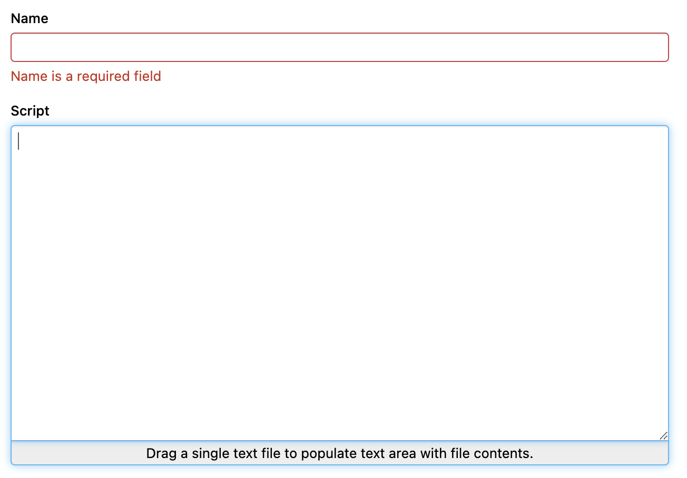
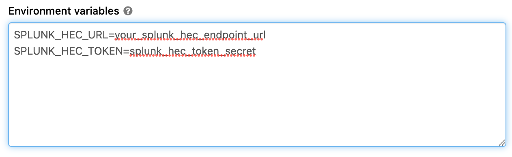

# databricks-splunk-hec

Tutorial for pushing Databricks log to Splunk HEC endpoint

## Configure HEC endpoint in Splunk

You need to create a HEC endpoint in your Splunk system if you don’t have one. We will not dive into this because there is a lot of materials for this in the Internet already: <https://docs.splunk.com/Documentation/Splunk/9.0.1/Data/UsetheHTTPEventCollector>

## Upload splunk-library-javalogging dependencies to Databricks

This library <https://github.com/splunk/splunk-library-javalogging> provided HttpEventCollectorLog4jAppender for Log4J to push log directly to Splunk HEC endpoint.

Databricks doesn’t have any Java dependencies manager, so in order to install this libraries, we need to download all the dependencies of this lib and install all to Databricks.

To download all the dependencies, use this pom.xml file <https://gist.github.com/nvinhphuc/09f866699bf813ae1ecf610a31ea7a91> and use this commands:

`mvn install dependency:copy-dependencies`

Then all the jar dependencies will be downloaded into target/dependencies

Compressed all this dependencies into `splunk_dependencies.zip`

***LAZY Shortcut***: If you are lazy, just grab this `splunk_dependencies.zip` in this repo <https://github.com/nvinhphuc/databricks-splunk-hec>.

Upload `splunk_dependencies.zip` into Databricks storage at `/FileStore/splunk`

## Write script to configure Log4J of Spark

In Databricks, Log4J configuration files locate in `/databricks/spark/dbconf/log4j/`
We need to add `SplunkHttp` appender to these files and ref this Appender in the loggers.

***LAZY Shortcut***: Download `init_script.sh` and `splunk_appender.py` from this repo: <https://github.com/nvinhphuc/databricks-splunk-hec>

Upload these file into Databricks storage `/FileStore/splunk`

## Step 4: Config global init script

You need to config Databricks global init script to run the script every time the clusters start to override the log configuration in the cluster.

Navigate to global init scripts in Admin Console.

Then drag and drop the `init_script.sh` file into the Script area. Set a name and enable the script.

## Step 5: Configure and restart cluster

Set `SPLUNK_HEC_URL` and `SPLUNK_HEC_TOKEN` environment variables in your cluster.

Restart your cluster and check your Splunk web to see the log.
